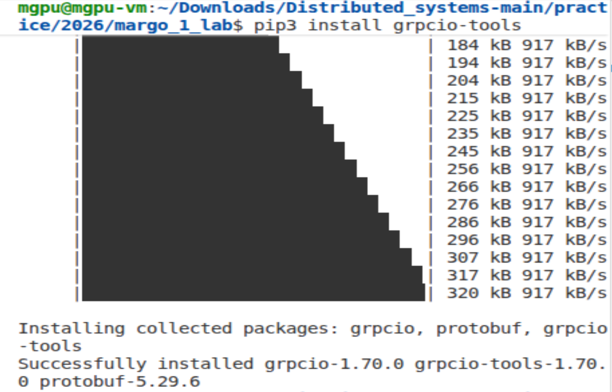
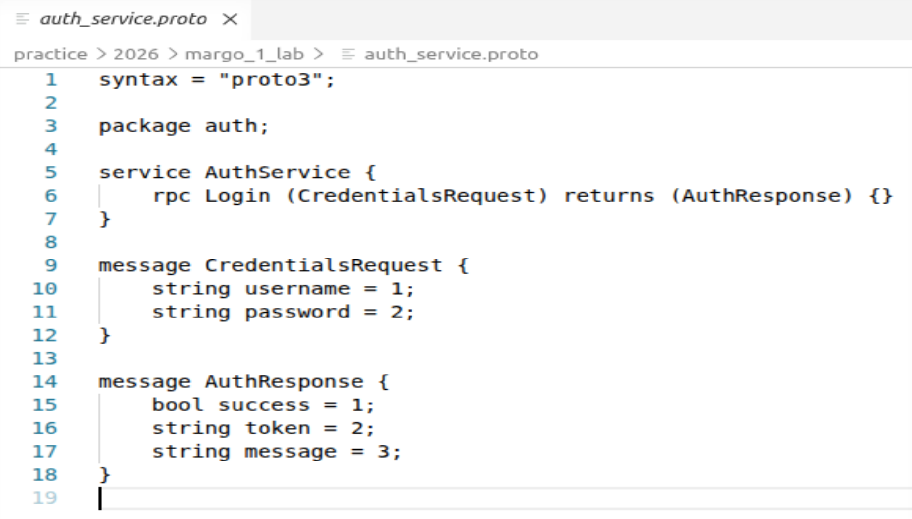
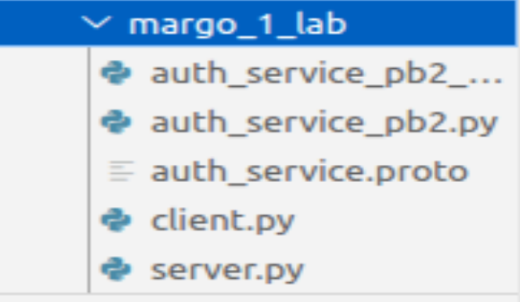
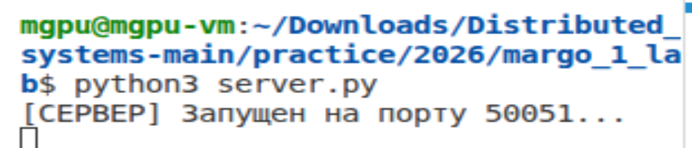
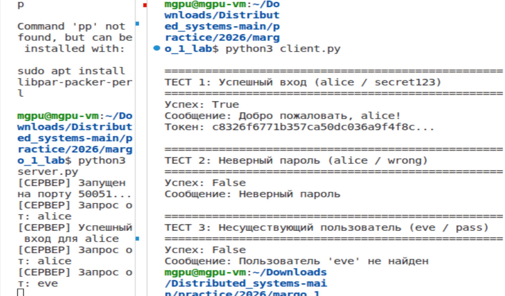

# 🧠 Лабораторная работа №1 🧠

# 🎓 Реализация RPC-сервиса с использованием gRPC 🎓

## 🌱 Вариант №9 🌱

🧾 **Задания:**
Аутентификация. Сервис AuthService с методом Login (Unary RPC).

👩‍🎓 **Студент:** Еськова Маргарита Ивановна 

👥 **Группа:** ЦИБ-241

## 📌 Цель работы

Освоить принципы удалённого вызова процедур (RPC) на примере gRPC, научиться описывать контракты с помощью Protocol Buffers, реализовать клиент-серверное приложение на Python с использованием gRPC.  

---

## 🧑‍💻 Описание сервиса  

Разработан сервис `AuthService` с унарным методом `Login`.  
Метод принимает логин и пароль, проверяет их по встроенной базе пользователей и возвращает результат аутентификации, а в случае успеха — сгенерированный токен.  

---

## 🔧 Архитектура

В работе реализована классическая **клиент-серверная архитектура** с использованием gRPC.

```
+------------------+         gRPC          +------------------+
|     КЛИЕНТ       |  <----------------->  |     СЕРВЕР       |
|   client.py      |     (HTTP/2)          |   server.py      |
+------------------+                       +------------------+
        |                                       |
        |                                       |
        |                                       v
        |                               +------------------+
        |                               |     USER_DB       |
        |                               |   (в памяти)      |
        |                               | alice/bob/admin   |
        |                               +------------------+
        |
        v
(данные возвращаются клиенту)
```

### Компоненты системы

Проект реализует классическую клиент-серверную архитектуру с использованием gRPC:

| Компонент | Описание |
|-----------|----------|
| **Сервер (server.py)** | Реализует бизнес-логику аутентификации, обрабатывает входящие RPC-вызовы, слушает порт 50051 |
| **Клиент (client.py)** | Устанавливает соединение с сервером, вызывает метод `Login` с разными наборами данных |
| **Контракт (auth_service.proto)** | Описывает сервис, метод и структуры сообщений — единый источник правды для обеих сторон |

### Тип RPC-взаимодействия

Используется **Unary RPC** (синхронный запрос-ответ):

1. Клиент отправляет один запрос (`CredentialsRequest`)
2. Сервер возвращает один ответ (`AuthResponse`)
3. Соединение закрывается

Этот тип выбран потому, что операция логина — атомарная: отправил данные → получил результат.

---
## 🛠️ Ход работы

### Установка зависимостей

Перед генерацией кода и запуском сервера были установлены необходимые пакеты:
- `grpcio` — основная библиотека gRPC для Python;
- `grpcio-tools` — компилятор Protocol Buffers для генерации кода из `.proto` файлов;
- `protobuf` — библиотека для работы с Protocol Buffers.

Установка выполнена командой:

```bash
pip3 install grpcio grpcio-tools
```


*Рисунок 1 — Установка пакетов grpcio и grpcio-tools*

## ✨ Генерация кода из .proto

На основе файла контракта [`auth_service.proto`](auth_service.proto) были сгенерированы вспомогательные файлы для работы с gRPC.


*Рисунок 2 — Листинг файла auth_service.proto*

Для генерации вспомогательных файлов из контракта использовалась следующая команда:

```bash
python3 -m grpc_tools.protoc -I. --python_out=. --grpc_python_out=. auth_service.proto
```
В результате выполнения команды были созданы два файла:

- [`auth_service_pb2.py`](auth_service_pb2.py) — содержит классы для сообщений (`CredentialsRequest`, `AuthResponse`);
- [`auth_service_pb2_grpc.py`](auth_service_pb2_grpc.py) — содержит классы для серверной и клиентской частей (`AuthServiceServicer`, `AuthServiceStub`).



*Рисунок 3 — Сгенерированные вспомогательные файлы*

## ☁️ Реализация сервера

Сервер реализован в файле [`server.py`](server.py).

### Класс `AuthServiceServicer`

Класс `AuthServiceServicer` наследуется от сгенерированного `auth_service_pb2_grpc.AuthServiceServicer` и переопределяет метод `Login`, содержащий основную бизнес-логику аутентификации.

### Алгоритм работы метода `Login`

1. Получить от клиента логин и пароль.
2. Проверить, существует ли пользователь во встроенном словаре `USER_DB`.
3. Если пользователь не найден — вернуть ответ с `success = False` и сообщением "Пользователь не найден".
4. Если пароль не совпадает — вернуть ответ с `success = False` и сообщением "Неверный пароль".
5. Если данные верны — сгенерировать уникальный токен (на основе имени пользователя и текущего времени) и вернуть ответ с `success = True`, токеном и приветственным сообщением.

### База данных пользователей

Встроенная база данных `USER_DB` хранится в памяти сервера и содержит следующие учётные записи:

| Логин | Пароль |
|-------|--------|
| alice | secret123 |
| bob | qwerty |
| admin | admin123 |

### Запуск сервера

- Сервер создаётся с пулом из 10 рабочих потоков (`ThreadPoolExecutor`) — это позволяет обрабатывать несколько запросов одновременно.
- Сервер привязывается к порту `50051` и начинает прослушивать входящие вызовы.


*Рисунок 4 — Запуск сервера*

## 📸 Реализация клиента

Клиент реализован в файле [`client.py`](client.py).

### Подключение к серверу

Клиент подключается к серверу по адресу `localhost:50051` и создаёт **stub** — объект-прокси для вызова удалённых методов:

1. Устанавливается соединение через `grpc.insecure_channel()`.
2. Создаётся объект `stub = auth_service_pb2_grpc.AuthServiceStub(channel)`.
3. Формируется запрос `CredentialsRequest` с полями `username` и `password`.
4. Вызывается метод `stub.Login()`, который отправляет запрос и ожидает ответа.
5. Полученный ответ `AuthResponse` выводится в терминал.

### Тестирование

Клиент автоматически выполняет три тестовых вызова:

| Тест | Логин | Пароль | Ожидаемый результат |
|------|-------|--------|---------------------|
| 1 | alice | secret123 | Успешный вход, получение токена |
| 2 | alice | wrong | Ошибка: "Неверный пароль" |
| 3 | eve | pass | Ошибка: "Пользователь не найден" |

При обработке запросов сервер выводит информацию о каждом вызове:


*Рисунок 5 — Вывод клиента в терминале*

На скриншоте видно:
- Запрос от `alice` — успешный вход;
- Запрос от `alice` с неверным паролем — ошибка аутентификации;
- Запрос от `eve` — пользователь не найден.

## 🎯 Выводы

В ходе выполнения лабораторной работы был успешно разработан и протестирован сервис аутентификации `AuthService` с использованием технологии gRPC.

**Что сделано:**
- Описан контракт в файле [`auth_service.proto`](auth_service.proto);
- Сгенерирован Python-код с помощью `protoc`;
- Реализован сервер ([`server.py`](server.py)), обрабатывающий запросы `Login`;
- Реализован клиент ([`client.py`](client.py)), тестирующий три сценария;
- Продемонстрирована работа унарного RPC-вызова.

**Что освоено:**
- Принципы удалённого вызова процедур (RPC);
- Работа с gRPC в Python;
- Описание структур данных и сервисов на языке Protocol Buffers;
- Автоматическая генерация кода из `.proto` файлов.

Таким образом, цель работы достигнута, все требования выполнены.

---

### 🔗 Что где искать

| Если нужно найти... | Смотреть в... |
|---------------------|---------------|
| Контракт сервиса | [`auth_service.proto`](auth_service.proto) |
| Код сервера | [`server.py`](server.py) |
| Код клиента | [`client.py`](client.py) |
| Сгенерированные файлы (сообщения и gRPC) | [`auth_service_pb2.py`](auth_service_pb2.py) и [`auth_service_pb2_grpc.py`](auth_service_pb2_grpc.py) |
| Скриншоты работы | Папка [`screenshots/`](screenshots) |
| Отчёт по ЛР №1 и ссылки на остальные работы | Весь репозиторий: [`distributed-systems`](https://github.com/Margarita-Eskova/distributed-systems/tree/main) |

## 🚀 Источники

1. Материалы курса «Распределённые системы» / Босенко Т.М.
2. Документация gRPC: https://grpc.io
3. Документация Protocol Buffers: https://protobuf.dev
