# 🔍 Лабораторная работа №2 🔍

# 👩‍💻 Проектирование и реализация клиент-серверной системы. HTTP, веб-серверы и RESTful веб-сервисы 🧑‍💻

## 🧩 Вариант №9 🧩

🧾**Задания:**


1. **HTTP-анализ** — проанализировать заголовок `Content-Type` при запросе к главной странице `vk.com` с помощью утилиты `curl`.

2. **REST API** — разработать API "Список вакансий" с сущностью: `id`, `job_title`, `company`. API должен поддерживать получение списка и создание нового элемента.

3. **Настройка Nginx** — настроить Nginx как обратный прокси для Flask API.

👩‍🎓**Студент:** Еськова Маргарита Ивановна  

👥**Группа:** ЦИБ-241

---

## 📌 Цель работы

Изучить методы отправки и анализа HTTP-запросов с использованием утилиты `curl`, освоить базовую настройку HTTP-сервера `nginx` в качестве обратного прокси, а также разработать RESTful веб-сервис на языке Python с использованием микрофреймворка Flask.

---

## 🔧 Архитектура

В работе реализована **трёхуровневая клиент-серверная архитектура** с использованием обратного прокси.


## 🛠️ Ход работы

## ✍️ Часть 1. Анализ HTTP-запроса к vk.com

### Выполнение

Для анализа заголовков был выполнен HTTP-запрос с методом `HEAD` (флаг `-I`), который позволяет получить только заголовки ответа без тела страницы.

**Команда:**

```bash
curl -I https://vk.com
```

**Результат выполнения:**

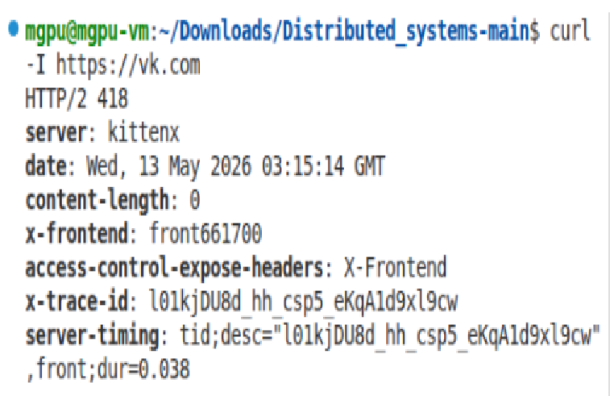

*Рисунок 1 — Простой curl-запрос*

### Анализ результата

| Параметр | Значение | Интерпретация |
|----------|----------|----------------|
| **Код состояния** | `418 I'm a teapot` | Сервер VK использует нестандартный механизм защиты от ботов |
| **Заголовок `Content-Type`** | отсутствует | Из-за статуса 418 сервер не передал тело ответа |
| **Сервер** | `kittenx` | Собственный веб-сервер VK вместо стандартных nginx/apache |

**Вывод:** При попытке проанализировать заголовки `vk.com` с помощью `curl`, сервер вернул HTTP-статус 418, что является намеренной блокировкой автоматических запросов. Заголовок `Content-Type` отсутствует, так как сервер не отдал тело ответа. В штатной ситуации (при запросе из браузера) ожидаемым значением было бы `text/html; charset=windows-1251`.

---

## ⭐ Часть 2. Разработка REST API «Список вакансий»

### Задание

Разработать REST API «Список вакансий» с сущностью: `id`, `job_title`, `company`.  
API должен поддерживать:
- `GET /api/jobs` — получение списка всех вакансий
- `GET /api/jobs/<id>` — получение одной вакансии по id
- `POST /api/jobs` — добавление новой вакансии

### Реализация

Сервис реализован на Python с использованием микрофреймворка Flask. Данные хранятся в оперативной памяти в виде списка словарей.

**Файл `app.py`:**

```python
from flask import Flask, jsonify, request
import datetime

app = Flask(__name__)

# База данных в памяти
jobs = [
    {
        "id": 1,
        "job_title": "Python Developer",
        "company": "TechCorp",
        "timestamp": datetime.datetime.now().isoformat()
    },
    {
        "id": 2,
        "job_title": "Junior Frontend Developer",
        "company": "WebStudio",
        "timestamp": datetime.datetime.now().isoformat()
    }
]
next_id = 3

@app.route('/api/jobs', methods=['GET'])
def get_jobs():
    return jsonify({"jobs": jobs})

@app.route('/api/jobs/<int:job_id>', methods=['GET'])
def get_job(job_id):
    job = next((j for j in jobs if j["id"] == job_id), None)
    if job is None:
        return jsonify({"error": "Вакансия не найдена"}), 404
    return jsonify(job)

@app.route('/api/jobs', methods=['POST'])
def create_job():
    global next_id
    if not request.json or not request.json.get('job_title') or not request.json.get('company'):
        return jsonify({"error": "Необходимо передать JSON с полями job_title и company"}), 400
    
    new_job = {
        "id": next_id,
        "job_title": request.json['job_title'],
        "company": request.json['company'],
        "timestamp": datetime.datetime.now().isoformat()
    }
    jobs.append(new_job)
    next_id += 1
    return jsonify(new_job), 201

if __name__ == '__main__':
    app.run(host='0.0.0.0', port=5000, debug=True)
```

## Запуск сервера

Для запуска сервера необходимо создать виртуальное окружение, установить Flask и выполнить файл `app.py`.

**Команды для запуска:**

```bash
# Создание виртуального окружения
python3 -m venv venv

# Активация окружения
source venv/bin/activate

# Установка Flask
pip install flask

# Запуск сервера
python3 app.py
```

**Результаты выполнения:**

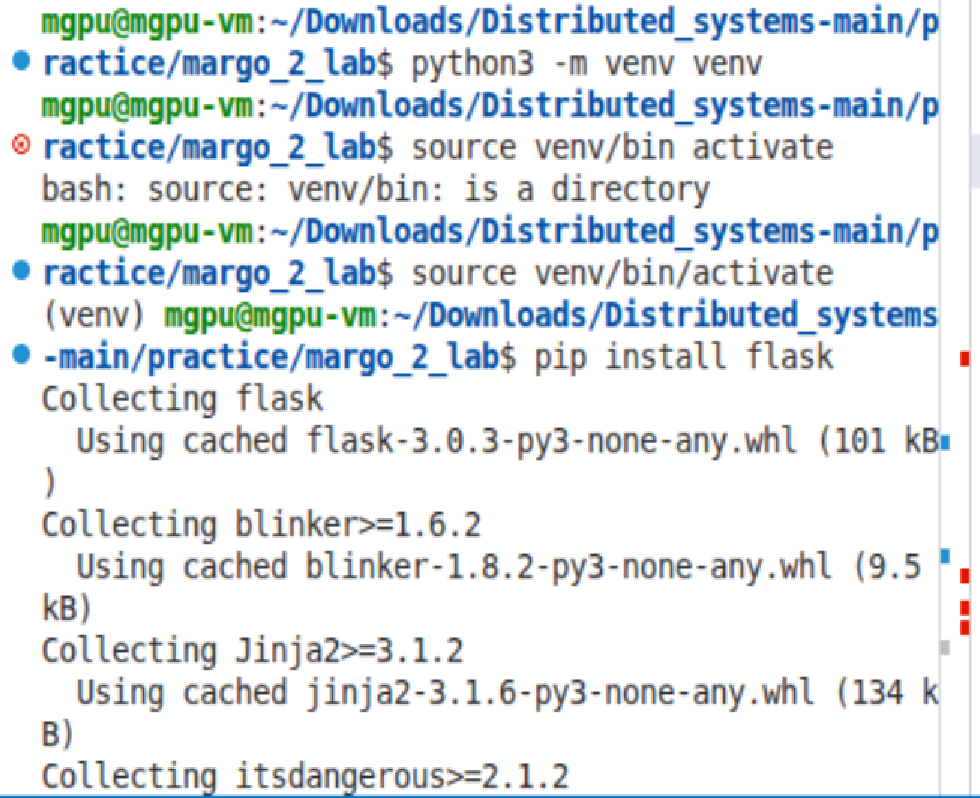
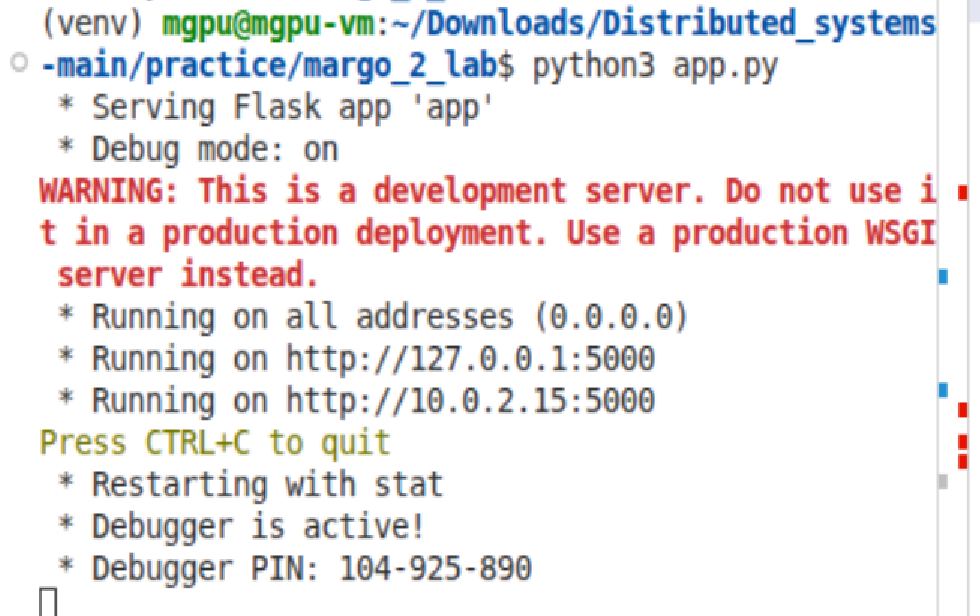

*Рисунки 2 и 3 — Запуск сервера*

## Тестирование API

После успешного запуска сервера были выполнены тестовые запросы для проверки работоспособности всех эндпоинтов.

### Тест 1. Получение списка всех вакансий (GET /api/jobs)

```bash
curl -s http://127.0.0.1:5000/api/jobs | python3 -m json.tool
```

**Результат:**

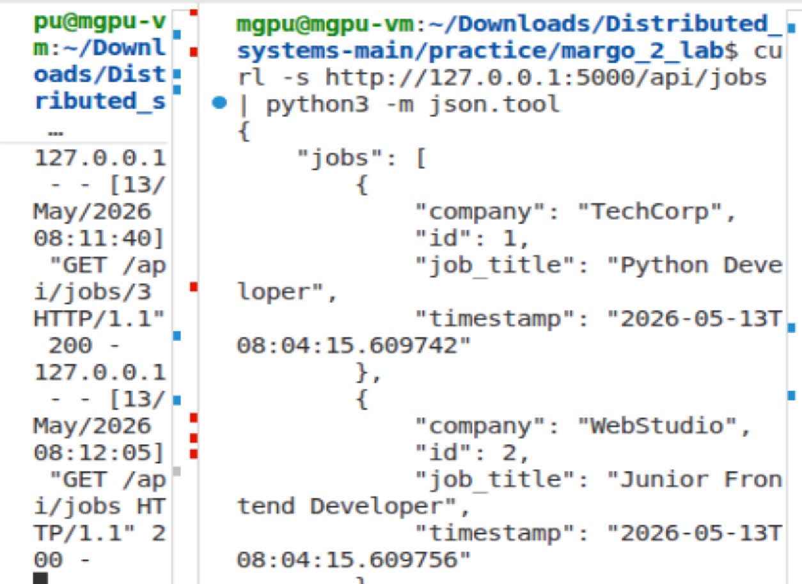

*Рисунок 4 — Тест 1. Список всех вакансий*

---

### Тест 2. Добавление новой вакансии (POST /api/jobs)

```bash
curl -X POST -H "Content-Type: application/json" -d '{"job_title": "Go Developer", "company": "Startup Inc"}' http://127.0.0.1:5000/api/jobs | python3 -m json.tool
```

**Результат:**

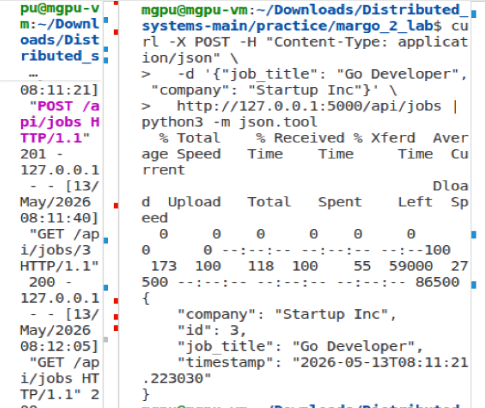

*Рисунок 5 — Тест 2. Список всех вакансий*

---

### Тест 3. Получение вакансии по ID (GET /api/jobs/3)

```bash
curl -s http://127.0.0.1:5000/api/jobs/3 | python3 -m json.tool
```

**Результат:**

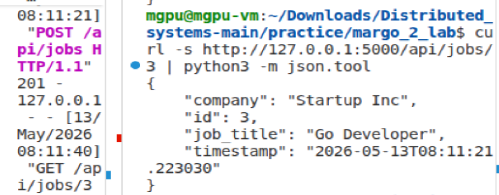

*Рисунок 6 — Тест 3. Вакансия по ID*

---

### Тест 4. Проверка обновлённого списка

```bash
curl -s http://127.0.0.1:5000/api/jobs | python3 -m json.tool
```

**Результат:**

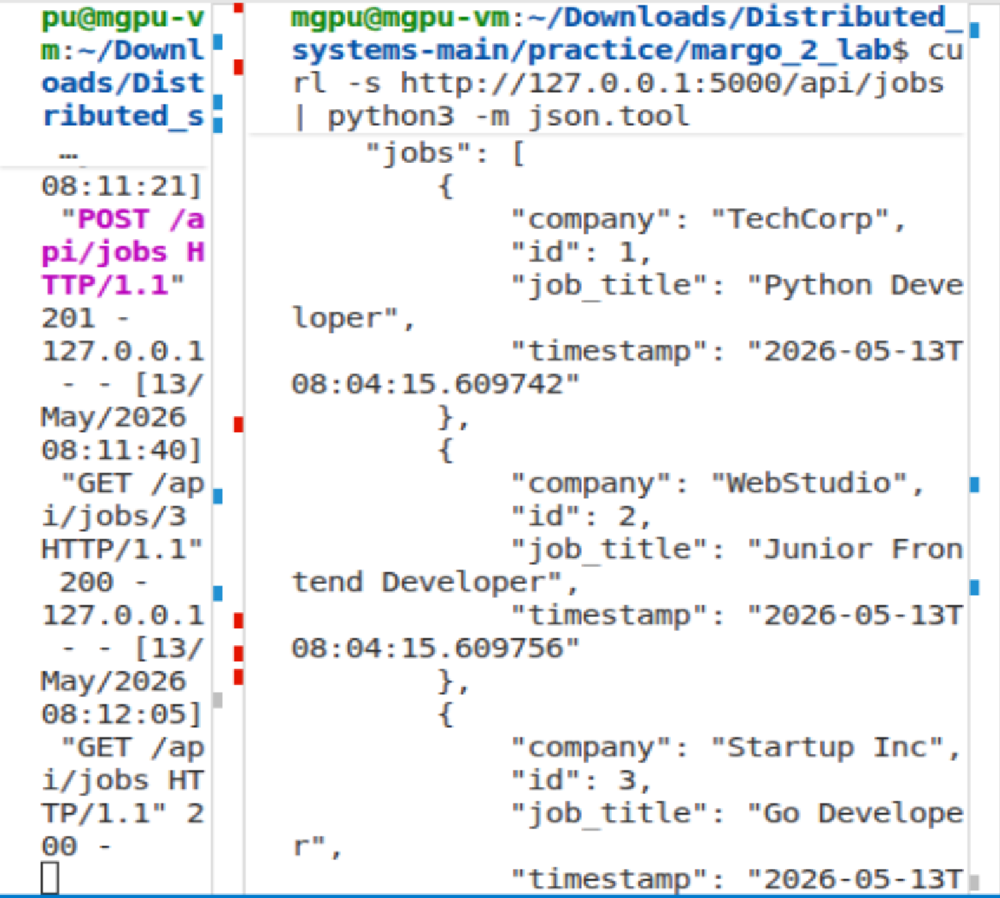

*Рисунок 7 — Тест 4. Обновлённый список*

---

### Логи сервера

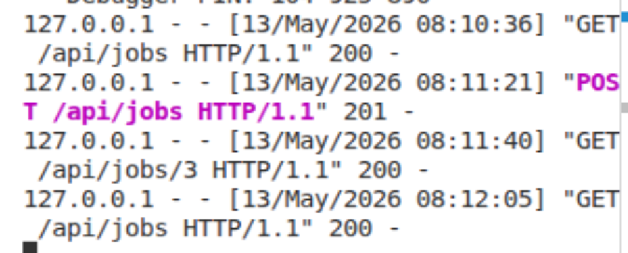

*Рисунок 8 — Логи сервера*

---

## Сводная таблица тестирования

| Тест | Метод | Эндпоинт | Ожидаемый код | Фактический код | Статус |
|------|-------|----------|---------------|-----------------|--------|
| 1 | GET | /api/jobs | 200 | 200 | ✅ |
| 2 | POST | /api/jobs | 201 | 201 | ✅ |
| 3 | GET | /api/jobs/3 | 200 | 200 | ✅ |
| 4 | GET | /api/jobs | 200 | 200 | ✅ |

---

## 📢 Часть 3. Настройка Nginx как обратного прокси

## Часть 3. Настройка Nginx как обратного прокси

### Задание

Настроить Nginx как обратный прокси для Flask API, чтобы все запросы, приходящие на `/api/`, перенаправлялись на Flask-приложение (порт 5000).

### Выполнение

#### 1. Установка и запуск Nginx

```bash
sudo apt update
sudo apt install nginx -y
sudo systemctl start nginx
sudo systemctl enable nginx
```
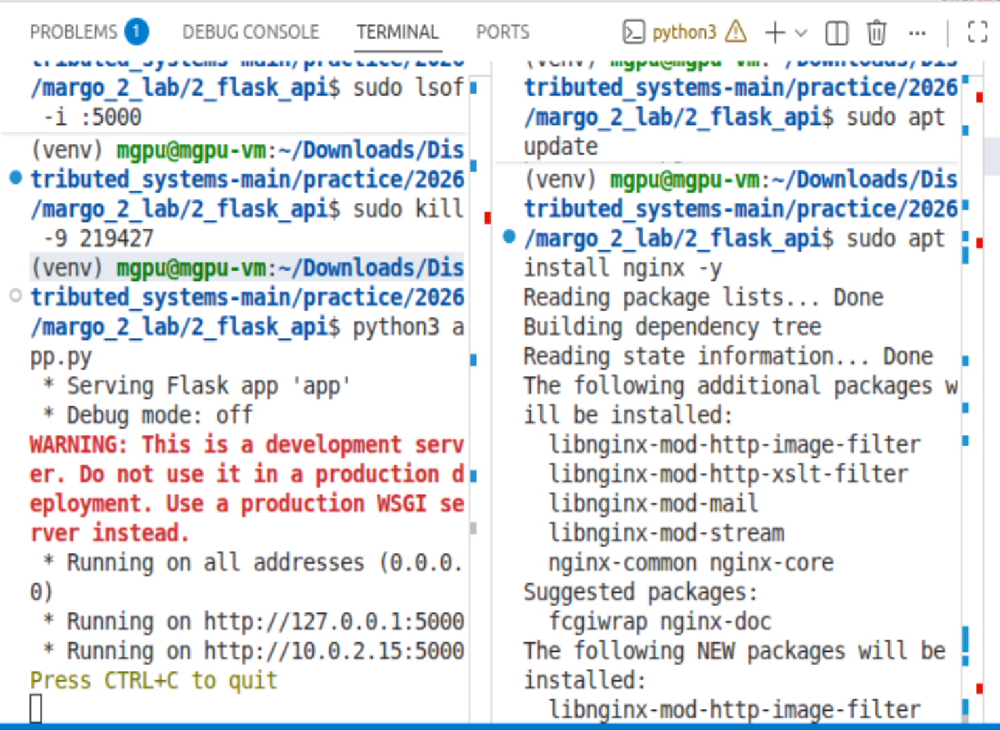

*Рисунок 9 — Установка и запуск Nginx*

#### 2. Настройка конфигурации

Был отредактирован файл `/etc/nginx/sites-available/default`.  

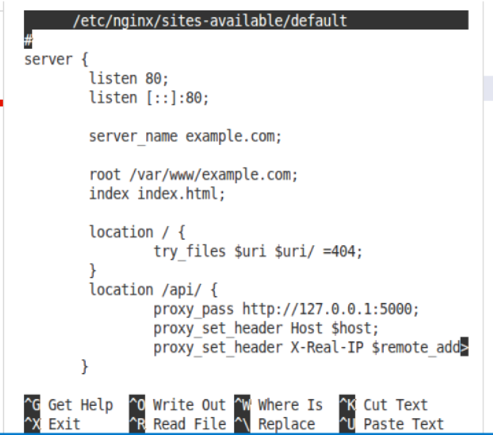

*Рисунок 10 — Итоговый рабочий конфиг*

В текстовом виде:

```nginx
server {
    listen 80 default_server;
    listen [::]:80 default_server;

    root /var/www/html;
    index index.html index.htm index.nginx-debian.html;

    server_name _;

    location / {
        try_files $uri $uri/ =404;
    }

    location /api/ {
        proxy_pass http://127.0.0.1:5000;
        proxy_set_header Host $host;
        proxy_set_header X-Real-IP $remote_addr;
    }
}
```

#### 3. Проверка конфигурации и перезапуск

После внесения изменений в конфигурационный файл необходимо проверить синтаксис и перезапустить Nginx.

```bash
sudo nginx -t
sudo systemctl restart nginx
```
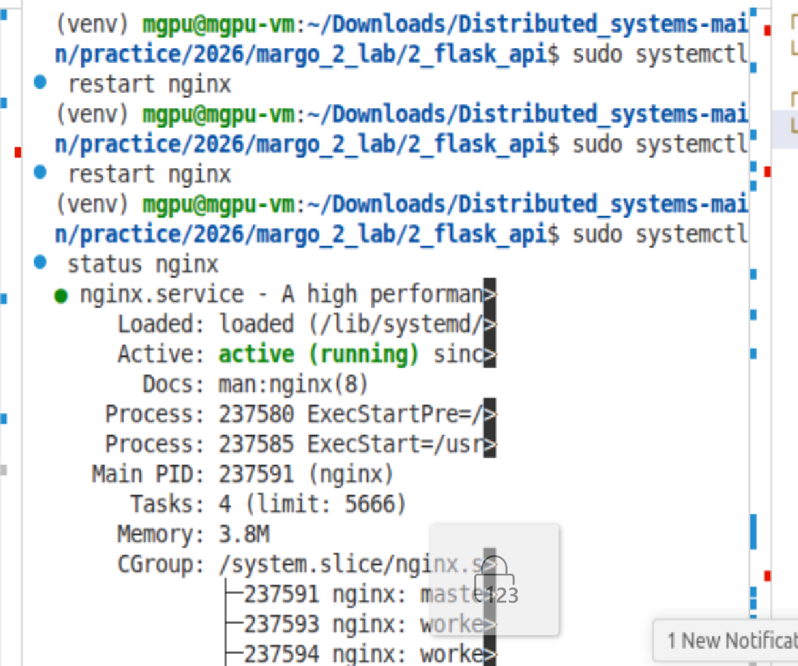

*Рисунок 11 — Проверка работы конфигурации*

#### 4. Тестирование API через Nginx

После успешного перезапуска Nginx и убедившись, что Flask-приложение запущено на порту 5000, был выполнен тестовый запрос к API через прокси-сервер Nginx (порт 80):

```bash
curl -s http://localhost/api/jobs
```

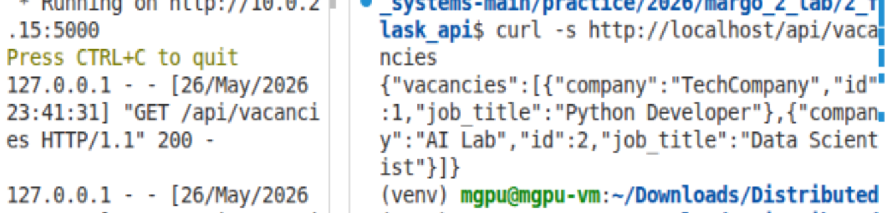

*Рисунок 12 — Тестирование API через Nginx*

**Полученный JSON-ответ:**

```json
{"jobs": [{"company": "TechCorp", "id": 1, "job_title": "Python Developer", "timestamp": "2026-05-26T22:37:37.123456"}, {"company": "WebStudio", "id": 2, "job_title": "Junior Frontend Developer", "timestamp": "2026-05-26T22:37:37.123456"}]}
```

**Анализ результата:**
- Код ответа: 200 OK
- Content-Type: application/json
- Данные полностью совпадают с ответом при прямом обращении к Flask-приложению на порту 5000

**Вывод:** Nginx успешно перенаправляет запросы с `/api/` на Flask-приложение, работающее на порту 5000. Прокси функционирует корректно.

---

## Сводная таблица тестирования (полная)

| Тест | Метод | Эндпоинт | Назначение | Код ответа | Статус |
|------|-------|----------|------------|-------------|--------|
| 1 | GET | /api/jobs (напрямую к Flask) | Получение списка вакансий | 200 | ✅ |
| 2 | POST | /api/jobs (напрямую к Flask) | Добавление новой вакансии | 201 | ✅ |
| 3 | GET | /api/jobs/3 (напрямую к Flask) | Получение вакансии по ID | 200 | ✅ |
| 4 | GET | /api/jobs (через Nginx) | Получение списка через прокси | 200 | ✅ |

---

## Выводы

В ходе выполнения лабораторной работы были решены следующие задачи:

1. **HTTP-анализ** — с помощью утилиты `curl` проанализированы заголовки ответа сервера vk.com. Обнаружена нестандартная защита от ботов (код 418 I'm a teapot), препятствующая автоматическим запросам. В штатной ситуации (при запросе из браузера) ожидаемым значением заголовка `Content-Type` является `text/html; charset=windows-1251`.

2. **Разработка REST API** — создан полноценный веб-сервис на Flask с эндпоинтами для получения списка вакансий, получения одной вакансии по ID и добавления новой вакансии. API протестирован с помощью `curl`, все тесты пройдены успешно.

3. **Настройка Nginx** — установлен и настроен веб-сервер Nginx в качестве обратного прокси. Все запросы к `/api/` успешно перенаправляются на Flask-приложение, скрывая его внутреннюю структуру и улучшая безопасность системы.

### Полученные навыки:
- Отправка и анализ HTTP-запросов с использованием `curl`
- Создание RESTful API на Flask
- Настройка виртуального окружения Python
- Установка и конфигурация Nginx
- Настройка обратного прокси для перенаправления трафика
- Тестирование взаимодействия компонентов клиент-серверной системы

---

## 📎 Заключение

Лабораторная работа выполнена в полном объёме. Все три части задания реализованы и протестированы. Полученные результаты соответствуют ожидаемым. Работа может быть допущена к защите.
