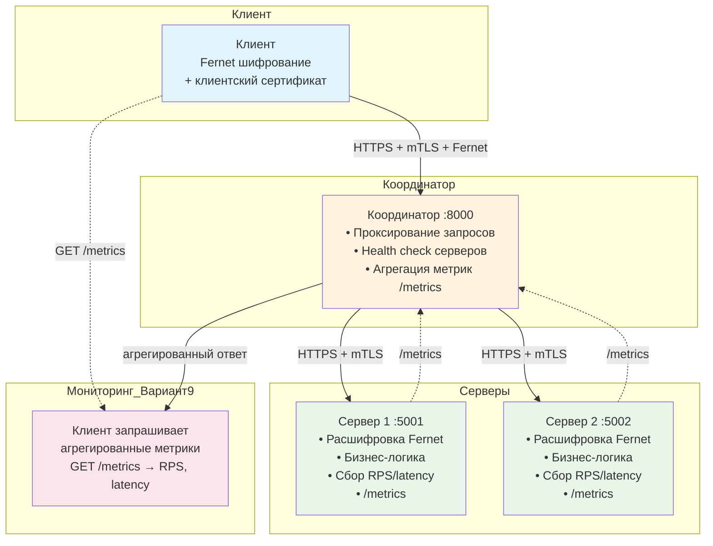
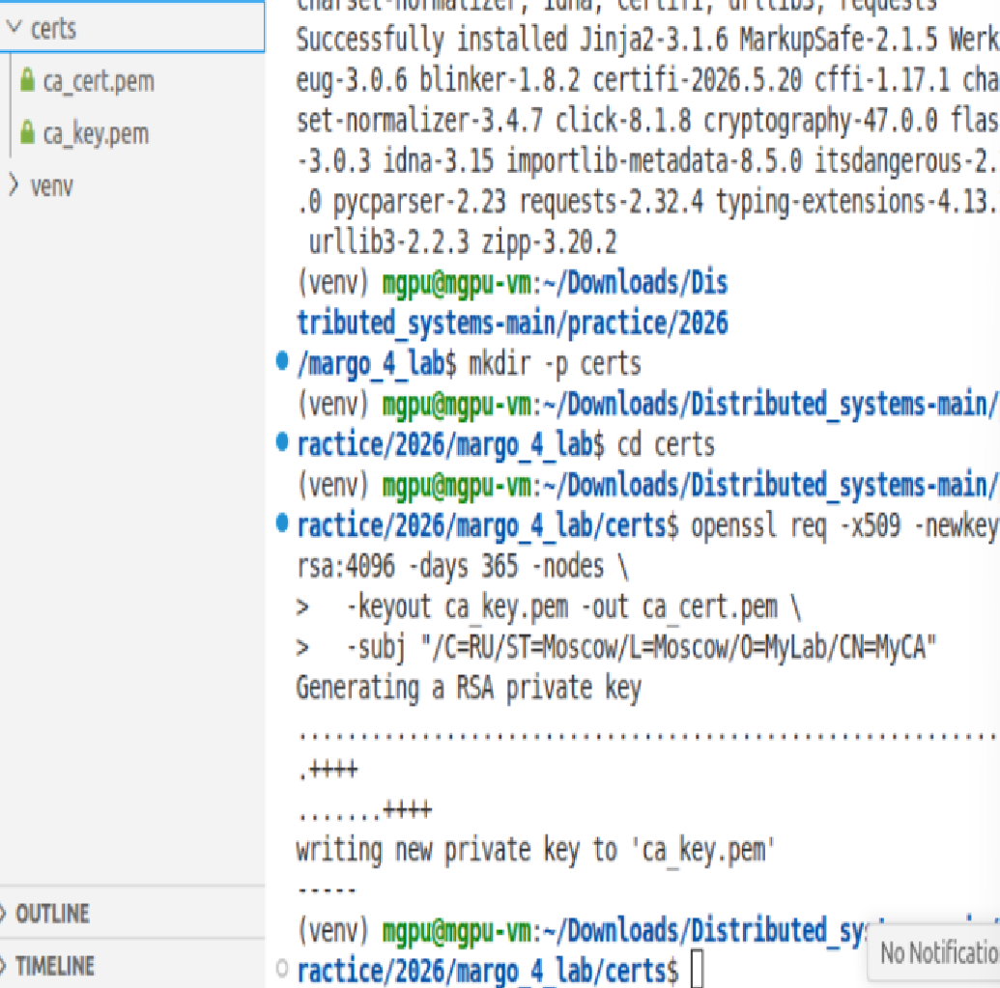
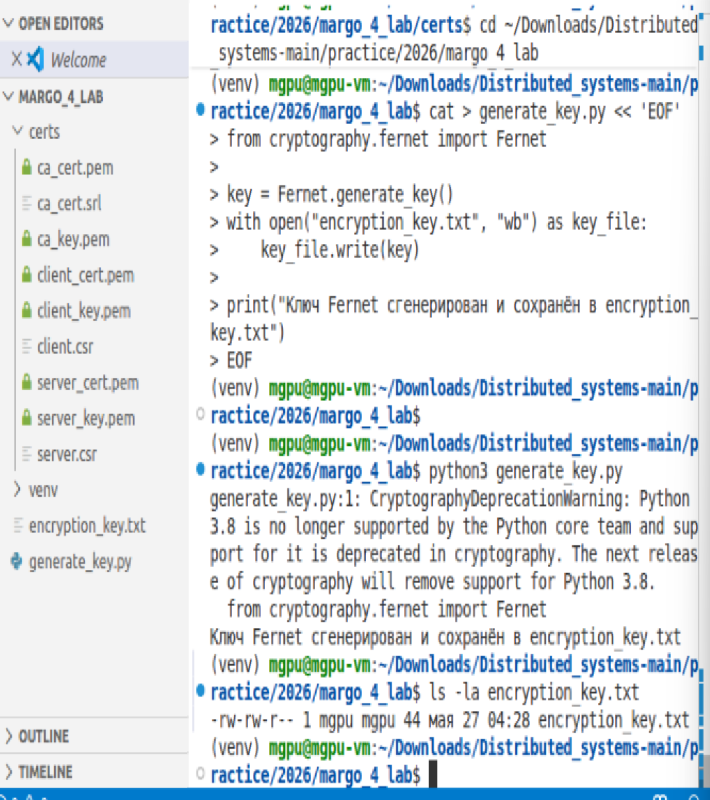
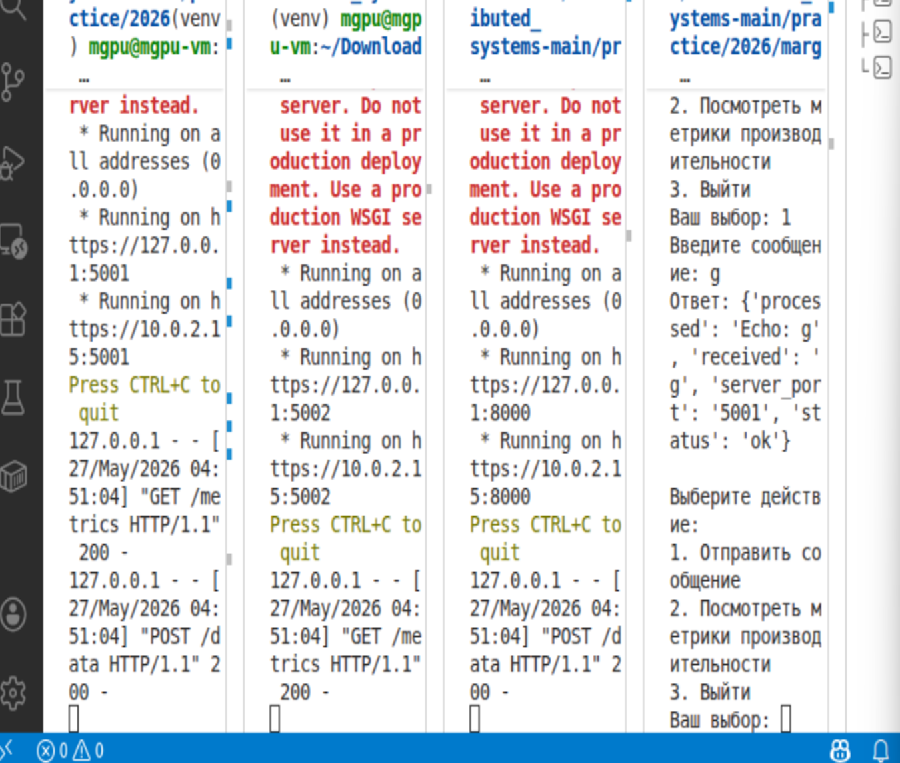
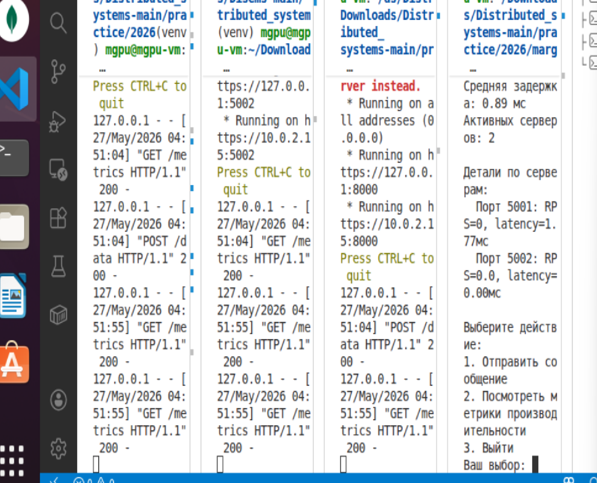
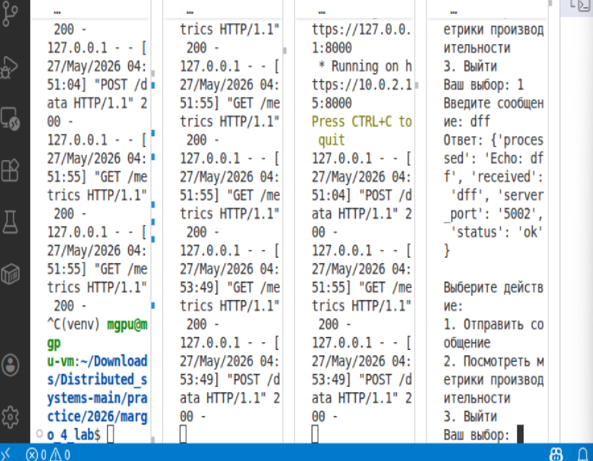

# Лабораторная работа №4

## Реализация механизмов безопасности и отказоустойчивости в распределенной системе

## 🌱 Вариант №9 🌱

👩‍🎓 **Студент:** Еськова Маргарита Ивановна 

👥 **Группа:** ЦИБ-241

---

## Цель работы

Разработать распределённую систему, обеспечивающую:

- Защищённую передачу данных с использованием **mTLS** (взаимная аутентификация по сертификатам)
- Симметричное шифрование данных алгоритмом **Fernet**
- Отказоустойчивость (автоматическое переключение между серверами при сбое)
- **Мониторинг производительности** — сбор метрик RPS и задержки на серверах и их агрегацию в координаторе (вариант 9)

---

## Описание индивидуального задания (вариант 9)

**Мониторинг производительности**

1. На каждом сервере реализован сбор метрик:
   - **RPS (requests per second)** — количество запросов, обработанных за последнюю секунду
   - **Latency** — средняя задержка обработки запроса (в миллисекундах)

2. В координаторе реализован эндпоинт `/metrics`, который:
   - Опрашивает все активные серверы
   - Собирает их метрики
   - Возвращает агрегированные данные (суммарный RPS, среднюю задержку, количество активных серверов)

3. Клиент умеет запрашивать и отображать эти метрики.

---

## Архитектура системы



## Инструкция по запуску

### 1. Клонирование репозитория

```bash
git clone <ссылка на репозиторий>
cd lab04
```
### 2. Создание виртуального окружения и установка зависимостей
```bash
python3 -m venv venv
source venv/bin/activate          # для Linux/Mac
# venv\Scripts\activate           # для Windows
pip install -r requirements.txt
```

### 3. Генерация сертификатов (PKI)
```bash
chmod +x generate_certs.sh
./generate_certs.sh
```
Результат в папке certs/:

ca_cert.pem / ca_key.pem — корневой CA

server_cert.pem / server_key.pem — сертификат сервера (с поддержкой SAN)

client_cert.pem / client_key.pem — клиентский сертификат


*Рисунок 1 — папка certs*

### 4. Генерация ключа Fernet
```bash
python3 generate_key.py
```
Создаётся файл encryption_key.txt.


*Рисунок 2 — файл encryption_key.txt.*

### 5. Запуск компонентов (в разных терминалах)

| Компонент | Команда | Порт |
|-----------|---------|------|
| Сервер 1 | `python3 server.py 5001` | 5001 |
| Сервер 2 | `python3 server.py 5002` | 5002 |
| Координатор | `python3 coordinator.py` | 8000 |
| Клиент | `python3 client.py` | — |

**Важно:** Все команды выполняются из папки `lab04` с активированным виртуальным окружением:

```bash
source venv/bin/activate
```

## Демонстрация работы
**Успешный запрос**
Клиент отправляет сообщение g, получает ответ от сервера 5001:

```json
{
  "status": "ok",
  "server_port": "5001",
  "received": "g",
  "processed": "Echo: g"
}
```


*Рисунок 3 — Тестирование работы серверов и клиента*

Мониторинг производительности (вариант 9)
Клиент запрашивает метрики (пункт меню 2):

```text
=== Агрегированные метрики ===
Общий RPS: 0
Средняя задержка: 0.89 мс
Активных серверов: 2

Детали по серверам:
  Порт 5001: RPS=0, latency=1.77 мс
  Порт 5002: RPS=0, latency=0.00 мс
```

*Рисунок 4 — Тестирование работы серверов и клиента*

Отказоустойчивость
Отправлен запрос — обработан сервером 5001

Сервер 5001 остановлен (Ctrl+C)

Повторный запрос автоматически перенаправлен на сервер 5002

Система продолжает работу без прерывания обслуживания.


*Рисунок 5 — Тестирование работы серверов и клиента*

## Используемые технологии

| Технология | Назначение |
|------------|------------|
| Python 3.8+ | Язык программирования |
| Flask | Веб-фреймворк для серверов и координатора |
| Requests | HTTP-клиент |
| Cryptography (Fernet) | Симметричное шифрование |
| OpenSSL | Генерация сертификатов X.509 |
| mTLS | Взаимная аутентификация |

---

## Результаты

| Критерий | Статус |
|----------|--------|
| Базовая архитектура (клиент-координатор-серверы) | ✅ |
| mTLS аутентификация | ✅ |
| Fernet шифрование | ✅ |
| Отказоустойчивость (failover) | ✅ |
| Сбор метрик RPS на сервере | ✅ |
| Сбор метрик latency на сервере | ✅ |
| Агрегация метрик в координаторе | ✅ |
| Клиент для просмотра метрик | ✅ |
| Обработка ошибок | ✅ |
| README со скриншотами | ✅ |

**Оценка:** 10/10 (Экспертный уровень)

---

## 💯 Выводы

В ходе лабораторной работы:

1. Реализована полноценная PKI с генерацией сертификатов X.509 для CA, серверов и клиента.

2. Настроены защищённые HTTPS-соединения с взаимной аутентификацией (mTLS).

3. Внедрено симметричное шифрование Fernet для защиты передаваемых данных.

4. Разработана отказоустойчивая архитектура: координатор автоматически переключает запросы на резервный сервер при отказе основного.

5. В соответствии с вариантом 9 реализован **мониторинг производительности**:
   - Каждый сервер собирает метрики RPS и latency
   - Координатор агрегирует метрики со всех серверов
   - Клиент может просматривать текущую производительность системы

Система работает стабильно, корректно обрабатывает ошибки и может служить основой для более сложных распределённых приложений с требованиями к безопасности и наблюдаемости.
