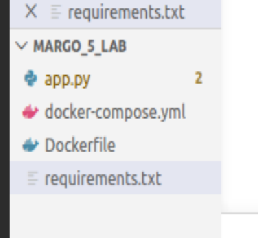
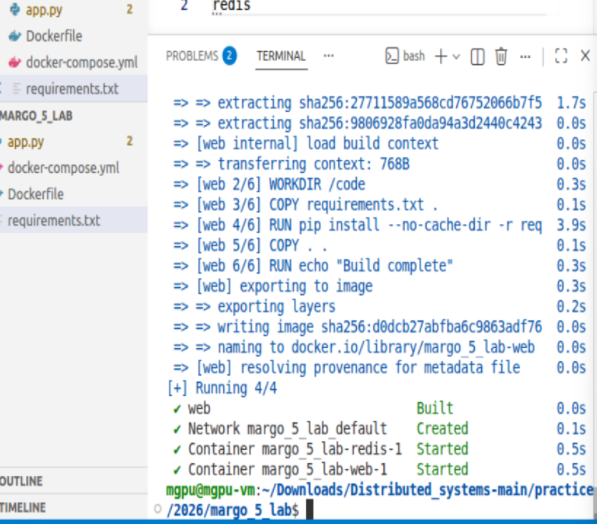
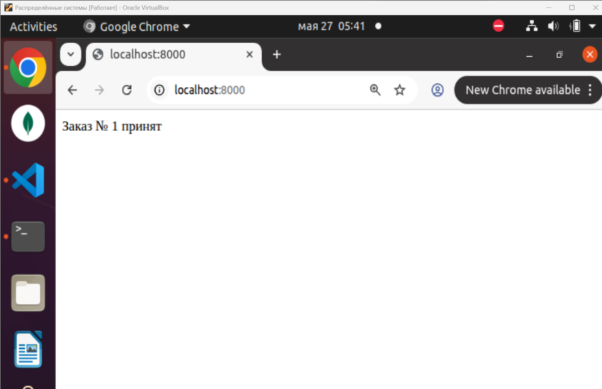

# 🖧 Лабораторная работа №5 🖧

# 🎵 Проектирование и реализация комплексной микросервисной системы для автоматизации бизнес-процесса с использованием Docker Compose. 🎵

## 💬 Вариант №9 💬

👩‍🎓 **Студент:** Еськова Маргарита Ивановна 

👥 **Группа:** ЦИБ-241


---

## 📌 Описание работы

Разработано веб-приложение на Flask с использованием Redis в качестве хранилища счётчика. Приложение запускается в Docker-контейнерах с помощью Docker Compose.

---

## 🧩 Выполненные задания (по варианту 9)

### 1. Бизнес-логика (`app.py`)
**Тема:** Очередь заказов  
**Реализация:** При каждом обновлении страницы номер заказа увеличивается на 1.  
**Вывод:** `Заказ № X принят` (где X — номер по порядку)

```python
order_number = cache.incr('order_counter')
return f"Заказ № {order_number} принят"
```
Вывод в браузере: Заказ № X принят (где X — номер по порядку)

### 2. Инфраструктура (docker-compose.yml)
Изменение: Образ Redis заменён на конкретную версию

```yaml
redis:
  image: redis:6.2
```

### 3. Среда сборки (Dockerfile)
Добавлена команда:

```dockerfile
RUN echo "Build complete"
```

При сборке образа в логах появляется сообщение Build complete, что подтверждает успешное выполнение слоя сборки.

### 🚀 Запуск проекта
```bash
docker compose up -d --build
```

После запуска приложение доступно по адресу:
👉 http://localhost:8000

### Остановка
```bash
docker compose down
```

### 🧪 Проверка работоспособности
Команда docker compose ps
```text
NAME                 STATUS          PORTS
margo_5_lab-web-1    Up              0.0.0.0:8000->5000/tcp
margo_5_lab-redis-1  Up              6379/tcp
```
### Браузер
При открытии страницы и её обновлении отображается:

```text
Заказ № 1 принят
Заказ № 2 принят
Заказ № 3 принят
```

### Скриншоты


*Рисунок 1 — Файлы проекта*


*Рисунок 2 — Запуск проекта*


*Рисунок 3 — Работа приложения в браузере*
