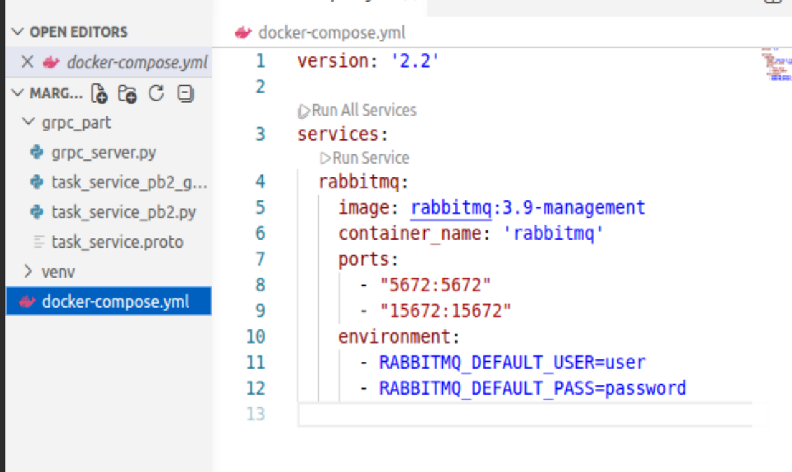
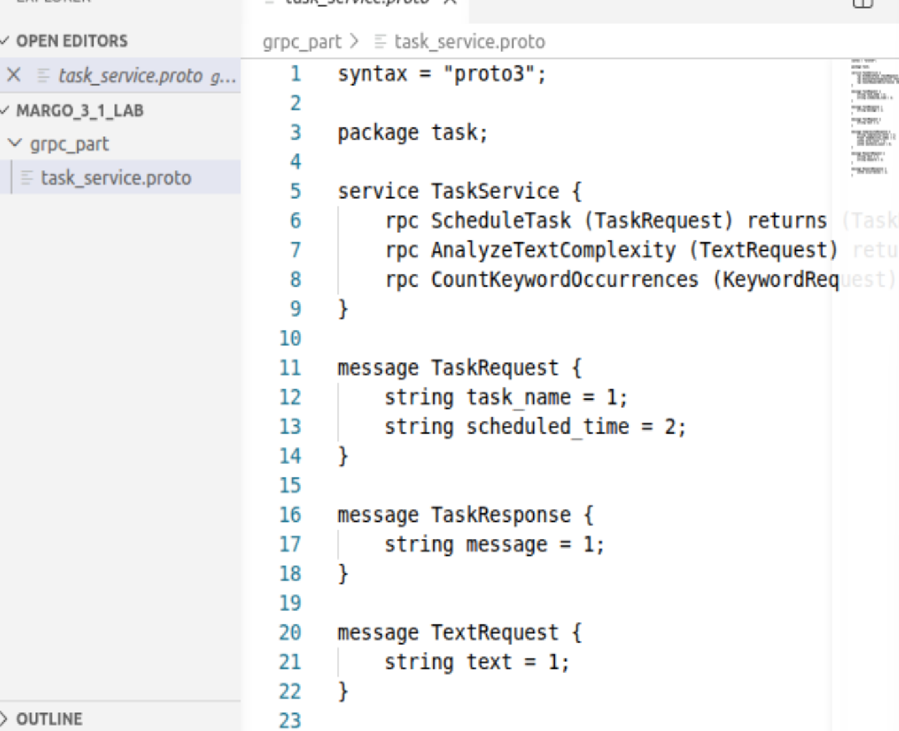
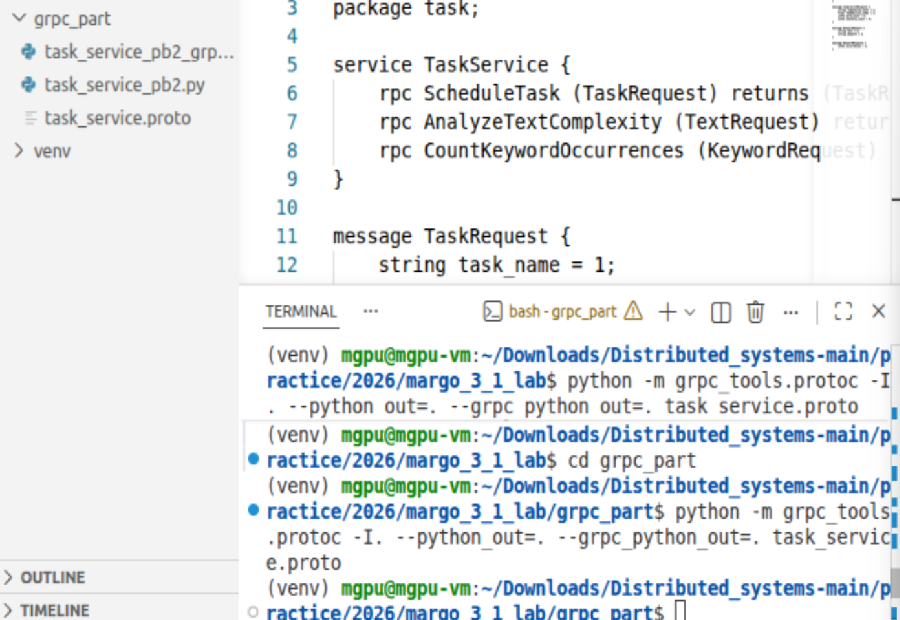
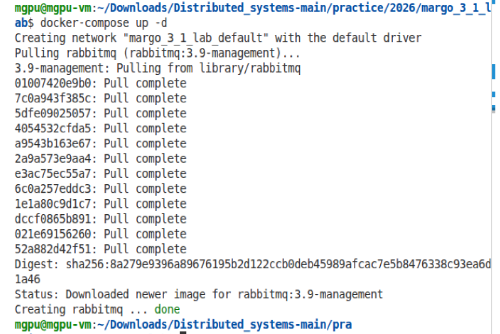
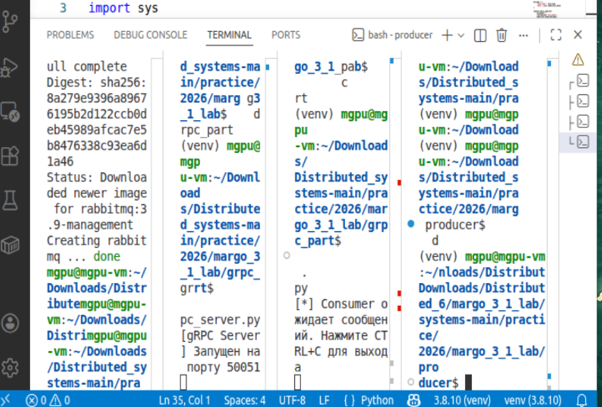
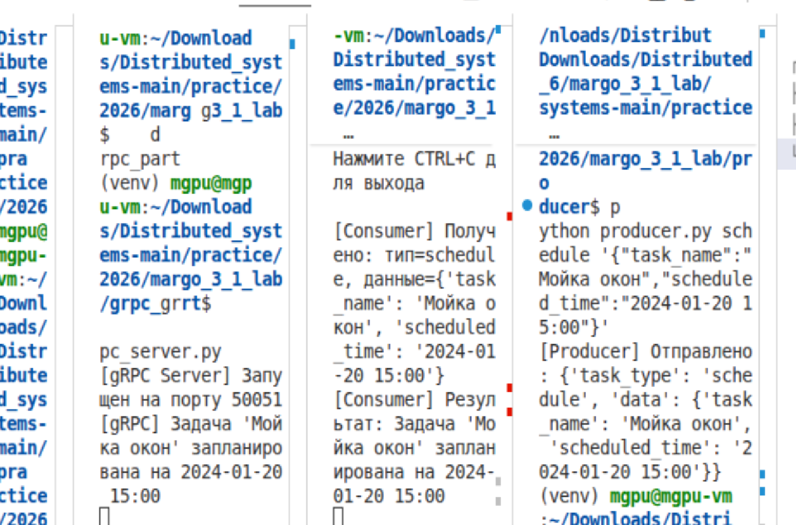
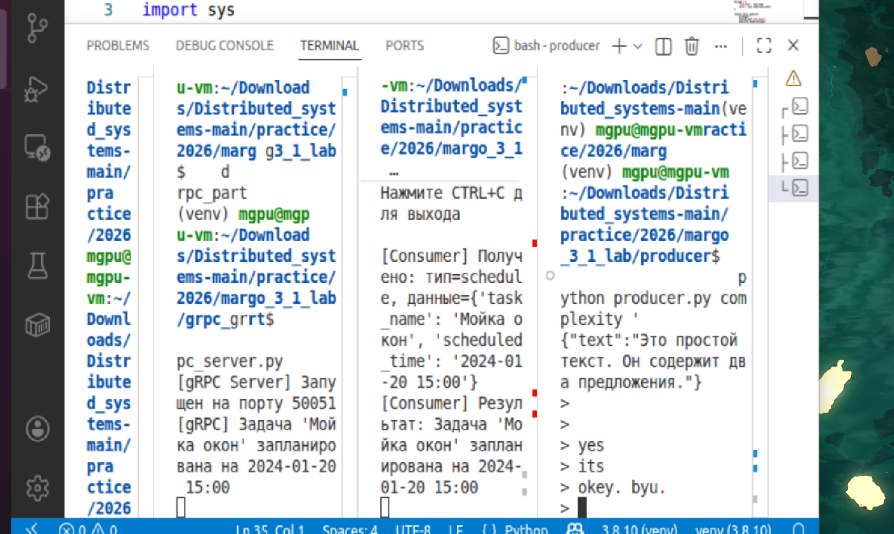
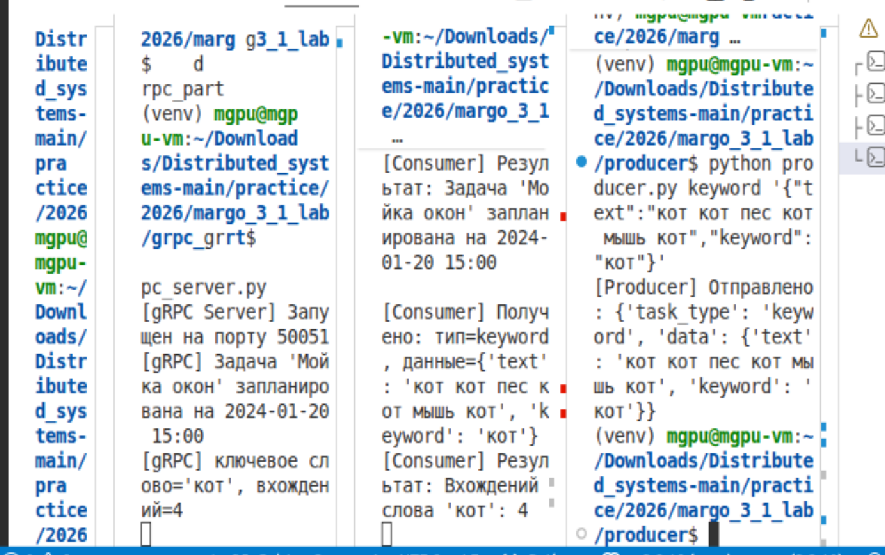

# ✨ Лабораторная работа №3-1. ✨

# 🤝 Асинхронное взаимодействие микросервисов с помощью брокера сообщений 🤝

# 🔬 Организация асинхронного взаимодействия микросервисов с помощью брокера сообщений 🔬

## 🏠 Вариант №9 🏠

🧾 **Задания:**

Необходимо реализовать систему асинхронной обработки запросов на основе RabbitMQ и gRPC.  
Пользователь через Producer отправляет сообщения в очередь RabbitMQ. Consumer получает сообщения из очереди и передаёт их в gRPC-сервер, который выполняет бизнес-логику и возвращает результат.

Три типа задач:

1. **Планирование задач** – Producer отправляет JSON с задачей и временем. gRPC-сервер возвращает подтверждение: "Задача запланирована на {время}".
2. **Анализ сложности текста** – Producer отправляет текст. gRPC-сервер вычисляет индекс читаемости (среднее количество слов в предложении) и возвращает уровень сложности: "Лёгкий", "Средний", "Сложный".
3. **Поиск по ключевым словам** – Producer отправляет текст и слово. gRPC-сервер возвращает количество вхождений этого слова.

👩‍🎓 **Студент:** Еськова Маргарита Ивановна 

👥 **Группа:** ЦИБ-241

## 📌 Цель работы

Изучить и реализовать два ключевых подхода к взаимодействию между сервисами: синхронное прямое взаимодействие с использованием gRPC и асинхронное взаимодействие через брокера сообщений RabbitMQ. Освоить развертывание инфраструктурных компонентов с помощью Docker.

---

## Архитектура


### Компоненты архитектуры

| Компонент | Роль | Вход / Зависимости | Выход / Данные | Протокол / Транспорт | Порт / Формат |
|-----------|------|---------------------|----------------|----------------------|---------------|
| **Producer (Отправитель)** | Принимает от пользователя тип задачи и JSON-данные, публикует сообщение в очередь RabbitMQ | аргументы командной строки (`task_type`, `json_data`) | JSON-сообщение в очередь `task_queue` RabbitMQ | AMQP 0-9-1 (библиотека Pika) | — |
| **RabbitMQ (Брокер сообщений)** | Хранит сообщения в очереди до обработки Consumer'ом, обеспечивает отказоустойчивость | очередь `task_queue` (durable = true) | сообщения потребителям | TCP | 5672 (клиент), 15672 (веб) |
| **Consumer (Получатель)** | Забирает сообщения из очереди, парсит JSON, вызывает gRPC-метод, подтверждает обработку (ack) | RabbitMQ (получение), gRPC Server (вызов) | результат вызова gRPC (строка) | AMQP + gRPC | — |
| **gRPC Server (Сервер обработки)** | Реализует RPC-методы, выполняет бизнес-логику, возвращает результат | `TaskRequest`, `TextRequest`, `KeywordRequest` | `TaskResponse`, `ComplexityResponse`, `KeywordResponse` | HTTP/2 (gRPC) | 50051 |

**Методы gRPC сервера:**

| Метод | Запрос (Request) | Ответ (Response) | Назначение |
|-------|------------------|------------------|------------|
| `ScheduleTask` | `TaskRequest` (task_name, scheduled_time) | `TaskResponse` (message) | Планирование задачи |
| `AnalyzeTextComplexity` | `TextRequest` (text) | `ComplexityResponse` (level, index, word_count, sentence_count) | Анализ сложности текста |
| `CountKeywordOccurrences` | `KeywordRequest` (text, keyword) | `KeywordResponse` (occurrences) | Подсчёт вхождений ключевого слова |

### 🐳 Часть 1. Синхронное взаимодействие (gRPC)

Клиент (Consumer внутри системы) напрямую вызывает методы gRPC-сервера и синхронно ожидает ответа.

**Схема синхронного взаимодействия**  
`Consumer (gRPC Stub)` → `gRPC Server (TaskService)` → `response`

Сервер реализует три метода, описанные в `task_service.proto`:
- `ScheduleTask`
- `AnalyzeTextComplexity`
- `CountKeywordOccurrences`

### 🪶 Часть 2. Асинхронное взаимодействие (RabbitMQ)

Система полностью асинхронна: Producer не ждёт обработки сообщения, а Consumer может быть масштабирован независимо.

**Схема асинхронного взаимодействия**  
`Producer` → `RabbitMQ (queue task_queue)` → `Consumer` → `gRPC Server`

**Компоненты:**
- **Producer** – забирает задание из аргументов командной строки и публикует JSON-сообщение в очередь `task_queue`.
- **RabbitMQ** – брокер сообщений, обеспечивает надёжную доставку (durable queue).
- **Consumer** – слушает очередь, при получении сообщения вызывает соответствующий метод gRPC-сервера.
- **gRPC Server** – выполняет бизнес-логику и возвращает результат Consumer.

**Преимущества асинхронного подхода в моём варианте:**  
- Разные типы задач (планирование, анализ, поиск) не блокируют друг друга.  
- Consumer можно запустить в нескольких экземплярах для параллельной обработки.  
- Если gRPC-сервер временно недоступен, сообщения остаются в очереди.

## 🔄 Реализация

### Файл docker-compose.yml

```yaml
version: '2.2'

services:
  rabbitmq:
    image: rabbitmq:3.9-management
    container_name: 'rabbitmq'
    ports:
      - "5672:5672"
      - "15672:15672"
    environment:
      - RABBITMQ_DEFAULT_USER=user
      - RABBITMQ_DEFAULT_PASS=password
```


*Рисунок 1 — Содержание файла docker-compose.yml*

### Контракт gRPC (task_service.proto)

```protobuf
syntax = "proto3";

package task;

service TaskService {
    rpc ScheduleTask (TaskRequest) returns (TaskResponse);
    rpc AnalyzeTextComplexity (TextRequest) returns (ComplexityResponse);
    rpc CountKeywordOccurrences (KeywordRequest) returns (KeywordResponse);
}

message TaskRequest {
    string task_name = 1;
    string scheduled_time = 2;
}

message TaskResponse {
    string message = 1;
}

message TextRequest {
    string text = 1;
}

message ComplexityResponse {
    string complexity_level = 1;
    float readability_index = 2;
    int32 word_count = 3;
    int32 sentence_count = 4;
}

message KeywordRequest {
    string text = 1;
    string keyword = 2;
}

message KeywordResponse {
    int32 occurrences = 1;
}
```


*Рисунок 2 — Содержание файла контракта*

### Генерация gRPC кода

Для генерации Python-кода по описанию `.proto` используется утилита `grpc_tools.protoc`:

```bash
python -m grpc_tools.protoc -I. --python_out=. --grpc_python_out=. task_service.proto
```
В результате создаются файлы:

task_service_pb2.py — определения сообщений (request/response)

task_service_pb2_grpc.py — определения сервера и клиента (stub)


*Рисунок 3 — генерация proto*

### 🚦 Запуск системы

**1. Установка зависимостей**

```bash
pip install grpcio grpcio-tools pika
```

**2. Запуск RabbitMQ**

```bash
docker-compose up -d
```


*Рисунок 4 — Запуск RabbitMQ*

**3. Запуск gRPC сервера** (терминал 1)

```bash
cd grpc_part
python grpc_server.py
```


*Рисунок 5 —  Запуск gRPC сервера*

**4. Запуск Consumer** (терминал 2)

```bash
cd grpc_part
python consumer.py
```

*Рисунок 6 —  Запуск Consumer*

**5. Отправка задач через Producer** (терминал 3)

```bash
cd producer
python producer.py schedule '{"task_name":"Мойка окон","scheduled_time":"2024-01-20 15:00"}'
```

*Рисунок 7 —  1 задача*

```bash
python producer.py complexity '{"text":"Это простой текст. Он содержит два предложения."}'
```


*Рисунок 8 —  2 задача*

```bash
python producer.py keyword '{"text":"кот кот пес кот мышь кот","keyword":"кот"}'
```


*Рисунок 9 —  3 задача*

### Результаты обработки


*Рисунок 10 — Consumer получает сообщения и выводит результаты обработки*

| Задание | Отправленные данные | Результат обработки |
|---------|---------------------|----------------------|
| Планирование задач | `{"task_name":"Мойка окон","scheduled_time":"2024-01-20 15:00"}` | Задача 'Мойка окон' запланирована на 2024-01-20 15:00 |
| Анализ сложности текста | `{"text":"Это простой текст. Он содержит два предложения."}` | Сложность: Легкий, Индекс: 5.00, Слов: 5, Предложений: 2 |
| Поиск по ключевым словам | `{"text":"кот кот пес кот мышь кот","keyword":"кот"}` | Вхождений слова 'кот': 4 |

### Вывод

В ходе лабораторной работы была реализована система асинхронной обработки задач на основе RabbitMQ и gRPC. Продемонстрированы преимущества асинхронного подхода: независимость компонентов, отказоустойчивость и возможность масштабирования Consumer. Все три задания варианта №9 выполнены и протестированы.

## Файлы проекта

| Файл | Назначение | Расположение |
|------|------------|--------------|
| `task_service.proto` | Контракт gRPC (описание сервиса и сообщений) | `grpc_part/` |
| `grpc_server.py` | Реализация gRPC сервера с тремя методами | `grpc_part/` |
| `consumer.py` | Получает сообщения из RabbitMQ, вызывает gRPC | `grpc_part/` |
| `producer.py` | Отправляет JSON-сообщения в очередь RabbitMQ | `producer/` |
| `docker-compose.yml` | Конфигурация запуска RabbitMQ | корень проекта |
