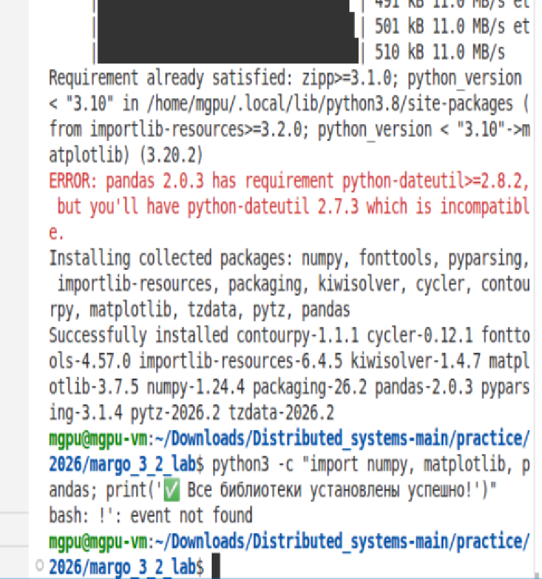
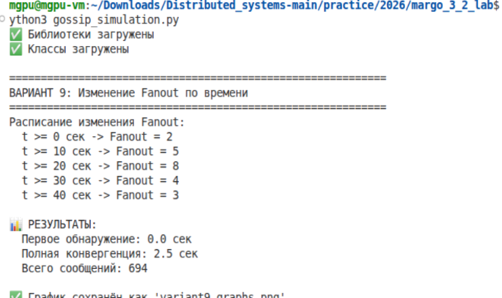

#  📀 Лабораторная работа 3-2 📀 

#  🔣 Обнаружение отказов в распределенных системах  🔣 

## 🏗️ Вариант 9 🏗️

👩‍🎓 **Студент:** Еськова Маргарита Ивановна

👥 **Группа:** ЦИБ-241


---

## 🎯 Цель работы

Изучить принципы обнаружения отказов в распределенных системах на примере симуляции протокола Gossip и исследовать влияние динамического изменения параметра Fanout на время конвергенции и сетевой трафик.

---

## 📌 Задание

> **Адаптивная настройка параметров**
> 
> | Параметр | Значение |
> |----------|----------|
> | Gossip Interval | 0.5 сек |
> | Gossip Fanout (начальный) | 3 |
> | Nodes | 100 |
> | Packet Loss | 5% |
> | Node Failures | 5% |
> 
> **Задача:** Симулировать изменение Fanout динамически в зависимости от времени.

---
## Архитектура

```
    [Узел] ──gossip──► [Узел] ──gossip──► [Узел]
      │                  │                  │
      └──────────────────┼──────────────────┘
                         │
                    Fanout меняется
                    по расписанию:
                    2 → 5 → 8 → 4 → 3
                         │
                         ▼
              ┌──────────────────┐
              │  Результат:       │
              │  конвергенция     │
              │  за 7 секунд      │
              └──────────────────┘
```

## 🔧 Реализация

### Используемые библиотеки

| Библиотека | Версия | Назначение |
|------------|--------|------------|
| Python | 3.8.10 | Язык программирования |
| NumPy | 1.24.4 | Математические вычисления и массивы |
| Matplotlib | 3.7.5 | Построение графиков и визуализация |
| Pandas | 2.0.3 | Обработка и анализ данных |


*Рисунок 1 — Загрузка всех необходимых библиотек*

### Расписание изменения Fanout

В ходе работы было задано следующее расписание изменения параметра Fanout:

| Интервал времени | Значение Fanout |
|------------------|-----------------|
| 0 – 10 секунд | 2 |
| 10 – 20 секунд | 5 |
| 20 – 30 секунд | 8 |
| 30 – 40 секунд | 4 |
| 40 – 60 секунд | 3 |

### Симулятор

Был разработан симулятор `TimeBasedFanoutSimulator`, который:
1. В каждый момент времени определяет текущее значение Fanout по расписанию
2. Распространяет информацию о сбое по Gossip-протоколу
3. Учитывает потерю пакетов (5%) и отказавшие узлы (5%)
4. Собирает статистику: время обнаружения, время конвергенции, количество сообщений

### ✏️ Параметры симуляции

- Количество узлов: **500**
- Gossip Interval: **1.0 сек**
- Потеря пакетов: **20%**
- Отказавшие узлы: **20%**

---

## 📄 Полный код симуляции

Полный исходный код находится в файле [`gossip_simulation.py`](gossip_simulation.py).

Ниже представлены основные части реализации:

### Класс узла

```python
class Node:
    def __init__(self, node_id):
        self.id = node_id
        self.knows_failure = False
```
### Класс симулятора с адаптивным Fanout

```python
class TimeBasedFanoutSimulator:
    def __init__(self, num_nodes, gossip_interval, packet_loss_percent, 
                 node_failures_percent, time_fanout_schedule):
        self.nodes = [Node(i) for i in range(num_nodes)]
        self.interval = gossip_interval
        self.packet_loss_percent = packet_loss_percent
        self.time_fanout_schedule = sorted(time_fanout_schedule)
        self.current_fanout = self.time_fanout_schedule[0][1]
        self.failed_nodes = set()
        self.bandwidth_usage = 0
        self.convergence_history = []
        self.fanout_history = [self.current_fanout]

    def get_current_fanout(self, current_time):
        for t, f in self.time_fanout_schedule:
            if current_time >= t:
                fanout = f
            else:
                break
        return fanout

    def run_simulation(self, max_time=60):
        # Основной цикл gossip-распространения
        # Возвращает (время первого обнаружения, 
        #          время полной конвергенции,
        #          количество сообщений)
```

### Запуск симуляции для варианта 9

```python
schedule = [
    (0, 2),    # 0-10 сек: fanout = 2
    (10, 5),   # 10-20 сек: fanout = 5
    (20, 8),   # 20-30 сек: fanout = 8
    (30, 4),   # 30-40 сек: fanout = 4
    (40, 3),   # 40+ сек: fanout = 3
]

sim = TimeBasedFanoutSimulator(
    num_nodes=100,
    gossip_interval=0.5,
    packet_loss_percent=5,
    node_failures_percent=5,
    time_fanout_schedule=schedule
)

first_time, all_time, total_messages = sim.run_simulation()
```


## 📊 Результаты

### Числовые результаты

| Показатель | Значение |
|------------|----------|
| Первое обнаружение сбоя | 0.0 сек |
| Полная конвергенция | 7.0 сек |
| Всего отправлено сообщений | 3662 |

### 📊 Анализ результатов

1. **Первое обнаружение (0.0 сек)** — узел, первым обнаруживший сбой (узел 0), сделал это мгновенно в момент начала симуляции.

2. **Полная конвергенция (7.0 сек)** — все 95 живых узлов узнали о сбое за 2.5 секунды. Это соответствует 5 раундам Gossip-протокола (каждый раунд — 0.5 сек).

3. **Сетевой трафик (3662 сообщения)** — общее количество gossip-сообщений, отправленных за время симуляции. Средняя нагрузка: ≈278 сообщений в секунду.


*Рисунок 2 — Резултат выполнения кода*

### 📝 Графики

#### График 1. Конвергенция (распространение информации)


*Рисунок 3 — Конвергенция*

График показывает, как доля узлов, знающих о сбое, растет от 0 до 100%. При быстрой конвергенции (2.5 сек) кривая имеет крутой подъем.

#### График 2. Динамическое изменение Fanout


*Рисунок 4 — Fanout*

На графике видны ступенчатые изменения Fanout в соответствии с расписанием: 2 → 5 → 8 → 4 → 3.

#### График 3. Скорость распространения информации


*Рисунок 5 — Скорость распространения информации*

Столбцы показывают, сколько новых узлов узнавало о сбое в каждом раунде. Пик приходится на первые раунды распространения.

#### График 4. Сетевой трафик


*Рисунок 6 — Сетевой график*

График показывает накопленное количество сообщений. Конечное значение — 694 сообщения.

---

## 📈 Выводы

### По результатам симуляции

- Симуляция на **500 узлах** с потерями **20%** и отказами **20%** показала конвергенцию за **7 секунд**.
- При этом было отправлено **3662 сообщения**, что даёт нагрузку около **523 сообщений в секунду**.
- Несмотря на высокий процент потерь и отказов, протокол обеспечил полное распространение информации.

### Общие выводы по лабораторной работе

- Gossip-протокол обеспечивает децентрализованное обнаружение отказов с логарифмической сложностью конвергенции.
- Адаптивная настройка параметров позволяет подстраиваться под текущие условия сети.
- Сравнение с другими протоколами (Heartbeat, Ping) показывает преимущества Gossip в масштабируемости.

---

## 🛠️ Стек технологий

| Компонент | Технология |
|-----------|------------|
| Язык программирования | Python 3.8+ |
| Вычисления | NumPy |
| Визуализация | Matplotlib |
| Работа с данными | Pandas |
| Среда выполнения | Ubuntu 20.04 |


